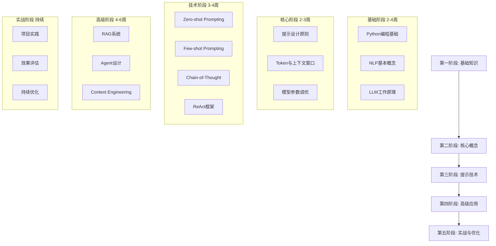
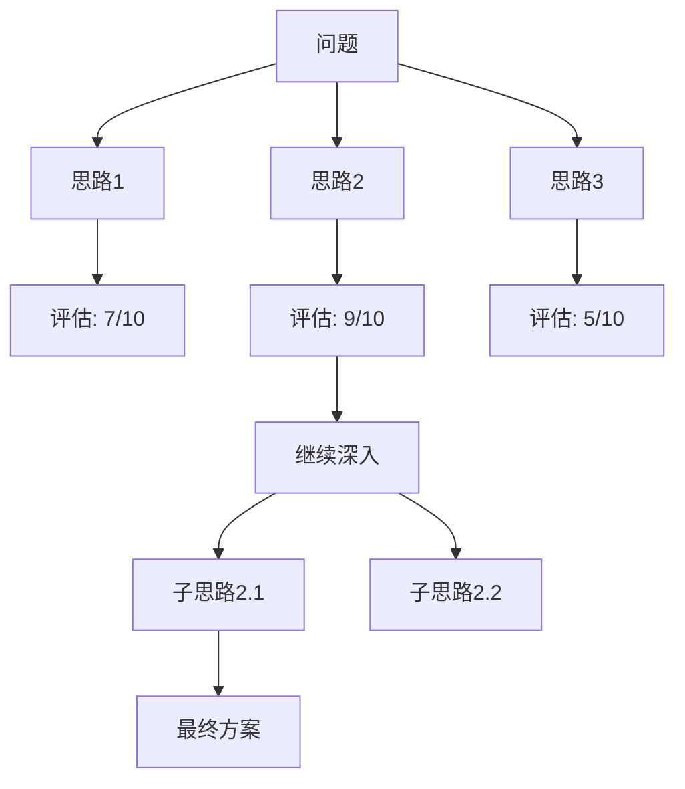
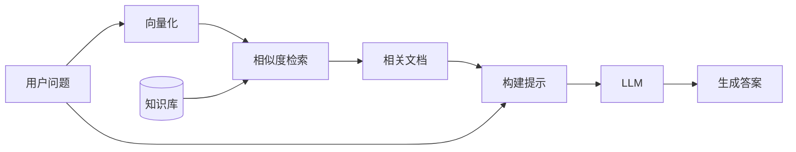
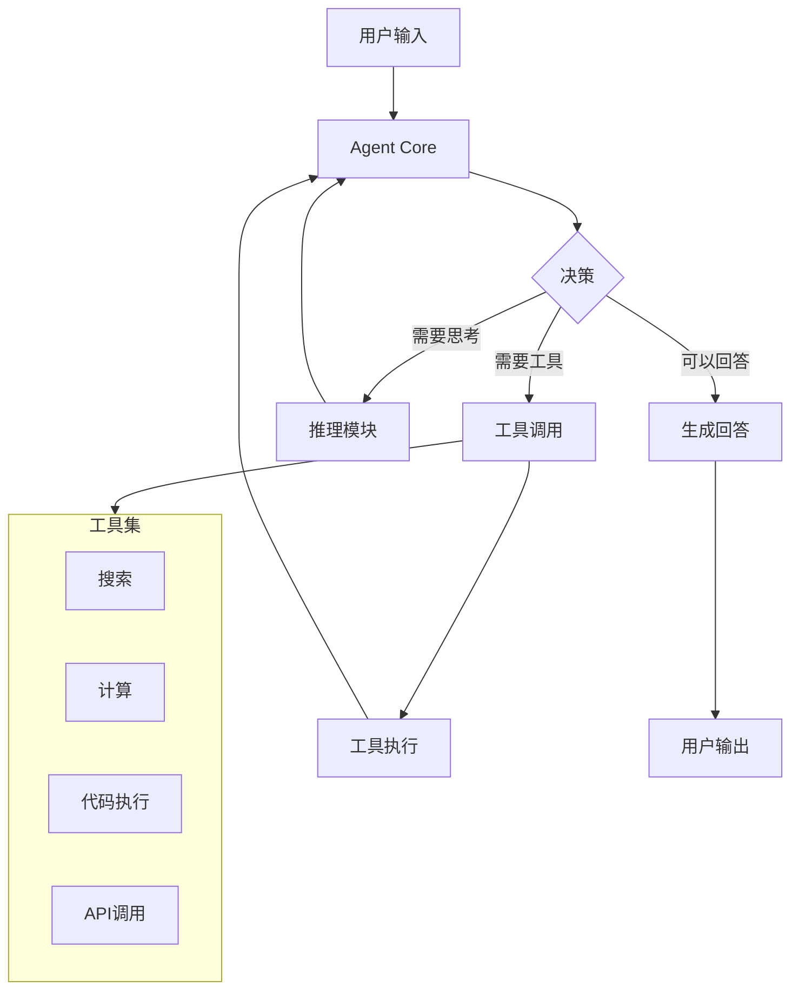
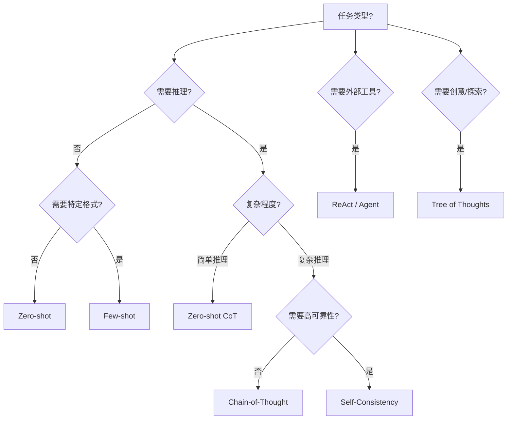
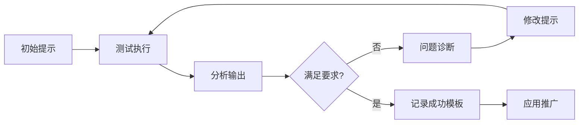
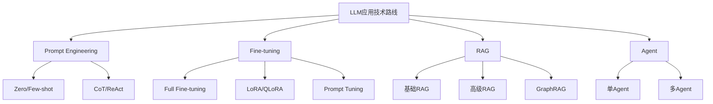
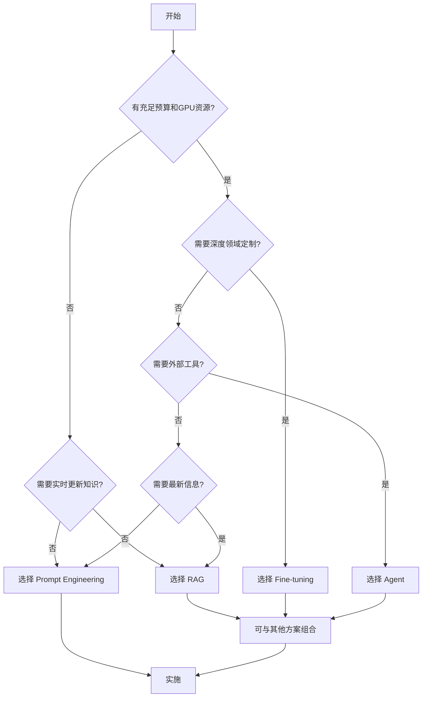
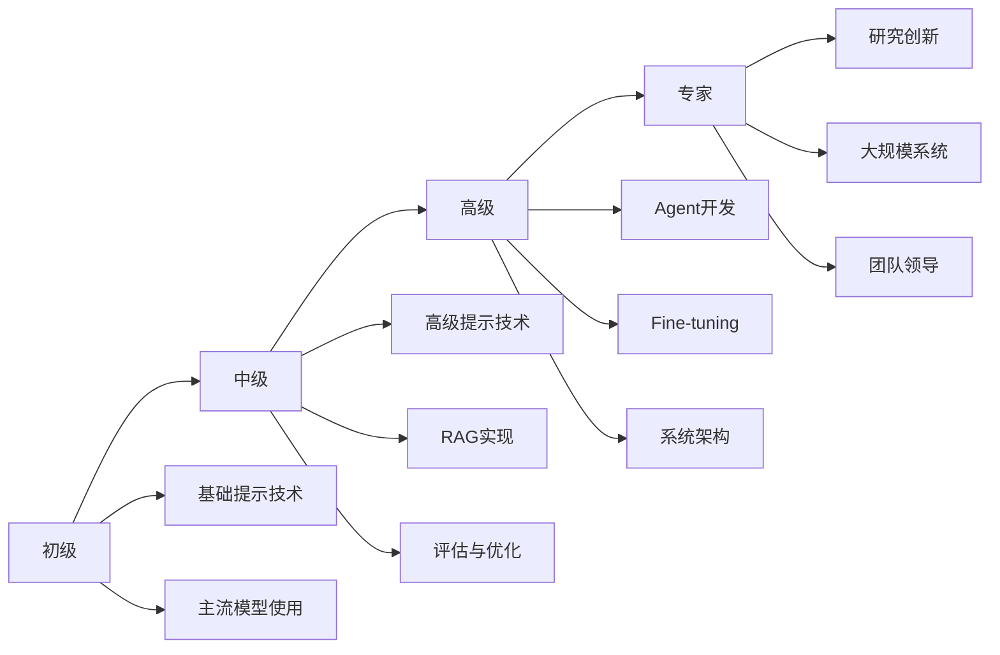

# Prompt Engineering 完整学习指南

> 最后更新: 2026年1月

## 目录

- [概述](#概述)
- [第一部分：学习路线](#第一部分学习路线)
- [第二部分：学习资源汇总](#第二部分学习资源汇总)
- [第三部分：核心方法论详解](#第三部分核心方法论详解)
- [第四部分：技术路线对比](#第四部分技术路线对比)
- [第五部分：实践建议与进阶路径](#第五部分实践建议与进阶路径)

---

## 概述

### 什么是 Prompt Engineering？

**Prompt Engineering（提示工程）** 是设计和优化输入提示（Prompt），以引导大型语言模型（LLM）生成期望输出的技术和艺术。随着 GPT-4、Claude、Gemini 等大型语言模型的普及，提示工程已成为 AI 领域最重要的技能之一。

### 为什么学习 Prompt Engineering？

1. **低门槛高回报**：无需深厚的编程基础，即可有效利用 AI 能力
2. **广泛适用性**：适用于开发、写作、数据分析、教育等多个领域
3. **职业前景**：Prompt Engineer 已成为新兴高薪职业
4. **AI 原生能力**：是与 AI 协作的核心技能

### 学习目标

通过本指南的学习，你将能够：
- 理解 LLM 的工作原理和限制
- 掌握各种提示技术及其适用场景
- 设计高质量的提示以获得精准输出
- 根据需求选择合适的技术路线

---

## 第一部分：学习路线

### 学习路线图



---

### 第一阶段：基础知识（2-4周）

#### 1.1 Python 编程基础

虽然 Prompt Engineering 不要求深厚的编程能力，但掌握 Python 基础将大大提升实践效率。

**学习内容：**
- Python 基本语法和数据结构
- 字符串处理和文本操作
- API 调用和 JSON 处理
- 常用库：`requests`, `json`, `pandas`

**学习资源：**
- [Python 官方教程](https://docs.python.org/3/tutorial/)
- 《Python编程：从入门到实践》
- Codecademy Python 课程

**示例代码：**
```python
import openai

def simple_prompt(prompt_text):
    """基本的 API 调用示例"""
    response = openai.ChatCompletion.create(
        model="gpt-4",
        messages=[
            {"role": "user", "content": prompt_text}
        ],
        temperature=0.7
    )
    return response.choices[0].message.content

# 使用示例
result = simple_prompt("请解释什么是机器学习")
print(result)
```

#### 1.2 自然语言处理（NLP）基础

**学习内容：**
- 文本表示：词向量、嵌入（Embedding）
- 语言模型的演进：从 n-gram 到 Transformer
- 注意力机制（Attention）基本概念
- 预训练与微调的区别

**核心概念：**

| 概念 | 说明 |
|------|------|
| Token | 模型处理文本的基本单位，可以是单词、子词或字符 |
| Embedding | 将文本转换为向量表示 |
| Attention | 模型关注输入不同部分的机制 |
| Context Window | 模型一次能处理的最大 Token 数量 |

#### 1.3 大型语言模型（LLM）工作原理

**核心知识点：**

1. **生成机制**：LLM 通过预测下一个最可能的 Token 来生成文本
2. **概率采样**：Temperature、Top-p 等参数控制输出的随机性
3. **上下文学习**：模型根据提供的上下文调整输出
4. **模型限制**：
   - 幻觉（Hallucination）：可能生成不真实的信息
   - 知识截止：训练数据有时间限制
   - 上下文长度限制

**主流 LLM 对比：**

| 模型 | 提供商 | 上下文窗口 | 特点 |
|------|--------|-----------|------|
| GPT-4/GPT-4o | OpenAI | 128K tokens | 综合能力强，推理出色 |
| Claude 3.5 | Anthropic | 200K tokens | 长文本处理优秀，安全性高 |
| Gemini 1.5 | Google | 1M tokens | 多模态能力强，超长上下文 |
| Llama 3 | Meta | 128K tokens | 开源可私有化部署 |
| DeepSeek | DeepSeek | 64K tokens | 中文能力强，性价比高 |

---

### 第二阶段：核心概念（2-3周）

#### 2.1 提示设计原则

**六大核心原则：**

##### 原则一：明确具体（Be Specific）
```
❌ 不好的提示：写一篇文章
✅ 好的提示：写一篇500字的科普文章，主题是量子计算的基本原理，
   目标读者是高中生，要求使用生动的比喻来解释复杂概念
```

##### 原则二：提供上下文（Provide Context）
```
❌ 不好的提示：帮我修改这段代码
✅ 好的提示：我正在开发一个 Python Web 应用，使用 Flask 框架。
   下面的代码用于用户认证，但登录后总是跳转到404页面。
   请帮我找出问题并修复：[代码]
```

##### 原则三：指定角色（Role Assignment）
```
✅ 示例：你是一位有20年经验的资深软件架构师。
   请评审以下系统设计方案，指出潜在的性能瓶颈和安全风险。
```

##### 原则四：分步指令（Step-by-Step Instructions）
```
✅ 示例：请按以下步骤分析这段文本：
   1. 首先，识别文本的主题和关键论点
   2. 然后，评估论证的逻辑性
   3. 接着，指出可能的偏见或假设
   4. 最后，给出总体评价和改进建议
```

##### 原则五：指定输出格式（Format Specification）
```
✅ 示例：请以 JSON 格式输出分析结果，包含以下字段：
   - summary: 一句话总结
   - key_points: 关键点列表
   - sentiment: 情感倾向（positive/negative/neutral）
   - confidence: 置信度（0-1）
```

##### 原则六：设定约束（Set Constraints）
```
✅ 示例：请用不超过100字回答以下问题。
   只使用给定的参考资料，如果资料中没有相关信息，请明确说明。
   避免使用技术术语，用通俗易懂的语言解释。
```

#### 2.2 Token 与上下文窗口

**Token 计算规则：**
- 英文：约 1 个单词 ≈ 1-1.5 tokens
- 中文：约 1 个汉字 ≈ 1.5-2 tokens
- 代码：变量名、符号各占不同 tokens

**上下文管理策略：**

```python
def manage_context(messages, max_tokens=4000):
    """上下文窗口管理示例"""
    total_tokens = sum(estimate_tokens(m['content']) for m in messages)
    
    while total_tokens > max_tokens and len(messages) > 2:
        # 保留系统消息和最新消息，删除中间的历史消息
        messages.pop(1)
        total_tokens = sum(estimate_tokens(m['content']) for m in messages)
    
    return messages
```

#### 2.3 模型参数调优

| 参数 | 取值范围 | 作用 | 建议使用场景 |
|------|----------|------|-------------|
| Temperature | 0-2 | 控制输出随机性 | 创意写作用0.7-1.0，精确任务用0-0.3 |
| Top-p | 0-1 | 核采样阈值 | 通常0.9-0.95，与Temperature二选一调整 |
| Max tokens | 1-模型上限 | 限制输出长度 | 根据任务需求设置 |
| Frequency penalty | -2到2 | 降低重复用词 | 需要多样化表达时设0.5-1.0 |
| Presence penalty | -2到2 | 鼓励新话题 | 需要发散思维时设0.5-1.0 |

---

### 第三阶段：提示技术（3-4周）

#### 3.1 Zero-shot Prompting（零样本提示）

**定义**：直接给出任务指令，不提供示例。

**适用场景：**
- 简单、明确的任务
- 模型已经"理解"的通用任务
- 快速原型验证

**示例：**
```
将以下英文翻译成中文：
"The quick brown fox jumps over the lazy dog."
```

**优点**：简单快速，Token 消耗少
**缺点**：复杂任务效果有限

---

#### 3.2 Few-shot Prompting（少样本提示）

**定义**：在提示中提供少量示例，帮助模型理解任务模式。

**适用场景：**
- 特定格式的输出
- 领域特定任务
- 需要风格一致性的任务

**示例：**
```
请将产品描述转换为营销标语：

产品描述：这款耳机采用主动降噪技术，续航40小时。
营销标语：静享音乐，持久相伴

产品描述：这款咖啡机可以在30秒内制作一杯浓缩咖啡。
营销标语：30秒，邂逅意式风情

产品描述：这款智能手表支持100+种运动模式，防水50米。
营销标语：
```

**最佳实践：**
- 示例数量：通常3-5个效果最佳
- 示例质量：确保示例准确、典型
- 示例多样性：覆盖不同情况
- 示例顺序：从简单到复杂

---

#### 3.3 Chain-of-Thought (CoT) 思维链提示

**定义**：引导模型展示推理过程，逐步得出结论。

**适用场景：**
- 数学计算
- 逻辑推理
- 多步骤问题解决
- 复杂决策分析

**标准 CoT 示例：**
```
问题：一个商店有100个苹果，第一天卖出30%，第二天卖出剩余的一半，请问还剩多少个苹果？

让我一步步思考：
1. 初始苹果数量：100个
2. 第一天卖出：100 × 30% = 30个
3. 第一天剩余：100 - 30 = 70个
4. 第二天卖出：70 × 50% = 35个
5. 最终剩余：70 - 35 = 35个

答案：还剩35个苹果。
```

**Zero-shot CoT：**
只需在问题后添加 "让我们一步步思考" 或 "Let's think step by step"

```
问题：[复杂问题]

让我们一步步思考这个问题。
```

**CoT 变体：**

| 变体 | 描述 | 适用场景 |
|------|------|----------|
| Zero-shot CoT | 添加"逐步思考"提示 | 快速启用推理 |
| Manual CoT | 手动编写推理示例 | 需要特定推理模式 |
| Auto-CoT | 自动生成推理链 | 大规模应用 |
| Self-Consistency | 多次采样取多数 | 提高可靠性 |

---

#### 3.4 ReAct（Reasoning + Acting）

**定义**：结合推理（Reasoning）和行动（Acting），让模型交替进行思考和执行操作。

**核心模式：**
```
Thought: [模型的思考过程]
Action: [采取的行动，如搜索、计算]
Observation: [行动的结果]
... (循环)
Thought: [最终思考]
Answer: [最终答案]
```

**示例：**
```
问题：2024年诺贝尔物理学奖得主是谁？他们的主要贡献是什么？

Thought: 我需要查找2024年诺贝尔物理学奖的信息。
Action: Search[2024 Nobel Prize Physics winner]
Observation: [搜索结果]

Thought: 根据搜索结果，我找到了获奖者信息。现在我需要总结他们的贡献。
Action: Search[获奖者名字 research contribution]
Observation: [搜索结果]

Thought: 我已经收集了足够的信息来回答问题。
Answer: [完整答案]
```

**适用场景：**
- 需要外部知识的问答
- 多步骤信息检索
- Agent 系统设计

---

#### 3.5 Tree of Thoughts (ToT) 思维树

**定义**：将问题分解为多个思考路径，并行探索，评估后选择最优路径。

**工作流程：**


**适用场景：**
- 创意生成
- 复杂规划问题
- 需要多方案对比的决策

**示例框架：**
```
问题：设计一个提高团队效率的方案

请生成3个不同的思路：

思路1：[描述]
评估：考虑可行性、成本、效果，打分 X/10

思路2：[描述]  
评估：考虑可行性、成本、效果，打分 X/10

思路3：[描述]
评估：考虑可行性、成本、效果，打分 X/10

选择得分最高的思路继续深入...
```

---

#### 3.6 其他重要提示技术

##### Self-Consistency（自一致性）
```
对同一问题生成多个推理路径，取最常见的答案
适用于需要高可靠性的场景
```

##### Directional Stimulus Prompting（定向刺激提示）
```
提供提示或线索引导模型向特定方向思考
示例：在回答中，请特别关注环境影响因素...
```

##### Generated Knowledge Prompting（生成知识提示）
```
步骤1：让模型先生成相关知识
步骤2：使用生成的知识来回答问题
```

##### Prompt Chaining（提示链）
```
将复杂任务分解为多个子任务
每个子任务的输出作为下一个任务的输入
```

---

### 第四阶段：高级应用（4-6周）

#### 4.1 RAG（Retrieval-Augmented Generation）

**定义**：检索增强生成，结合外部知识库提升模型输出的准确性和时效性。

**架构流程：**


**核心组件：**

| 组件 | 功能 | 常用工具 |
|------|------|----------|
| 文档加载 | 读取各种格式文档 | LangChain Loaders, Unstructured |
| 文本分割 | 将文档切分为块 | RecursiveCharacterTextSplitter |
| 向量化 | 文本转向量 | OpenAI Embeddings, BGE, Jina |
| 向量数据库 | 存储和检索向量 | Pinecone, Milvus, Chroma, FAISS |
| 检索器 | 查找相关文档 | Similarity Search, MMR |

**RAG 提示模板：**
```
基于以下参考资料回答问题。如果资料中没有相关信息，请明确说明。

参考资料：
{retrieved_documents}

问题：{user_question}

请提供准确、有依据的回答，并标注信息来源。
```

---

#### 4.2 Agent 系统设计

**定义**：具有自主决策能力的 AI 系统，能够使用工具、执行多步骤任务。

**Agent 核心组件：**



**工具定义示例：**
```python
tools = [
    {
        "type": "function",
        "function": {
            "name": "search_web",
            "description": "搜索互联网获取最新信息",
            "parameters": {
                "type": "object",
                "properties": {
                    "query": {
                        "type": "string",
                        "description": "搜索关键词"
                    }
                },
                "required": ["query"]
            }
        }
    },
    {
        "type": "function", 
        "function": {
            "name": "calculate",
            "description": "执行数学计算",
            "parameters": {
                "type": "object",
                "properties": {
                    "expression": {
                        "type": "string",
                        "description": "数学表达式"
                    }
                },
                "required": ["expression"]
            }
        }
    }
]
```

---

#### 4.3 Context Engineering（上下文工程）

**定义**：系统性地构建和管理提供给模型的上下文信息，是 Prompt Engineering 的进阶形态。

**与 Prompt Engineering 的区别：**

| 维度 | Prompt Engineering | Context Engineering |
|------|-------------------|---------------------|
| 关注点 | 单次提示的设计 | 整体上下文系统 |
| 范围 | 静态提示文本 | 动态信息流 |
| 复杂度 | 相对简单 | 系统性工程 |
| 应用 | 单次交互 | 复杂应用系统 |

**上下文工程要素：**

1. **系统提示（System Prompt）管理**
   - 角色定义
   - 行为准则
   - 能力边界

2. **动态上下文注入**
   - 用户信息
   - 会话历史
   - 实时数据

3. **知识管理**
   - 领域知识库
   - 检索策略
   - 更新机制

4. **记忆系统**
   - 短期记忆（会话内）
   - 长期记忆（跨会话）
   - 记忆压缩与提取

---

## 第二部分：学习资源汇总

### 官方文档与指南

| 资源 | 链接 | 说明 |
|------|------|------|
| OpenAI Prompt Engineering Guide | https://platform.openai.com/docs/guides/prompt-engineering | OpenAI 官方最佳实践 |
| Anthropic Prompt Engineering | https://docs.anthropic.com/claude/docs/prompt-engineering | Claude 模型专属指南 |
| Google AI Prompting Guide | https://ai.google.dev/docs/prompting | Gemini 模型使用指南 |
| Microsoft Prompt Engineering | https://learn.microsoft.com/azure/ai-services/openai/concepts/prompt-engineering | Azure OpenAI 文档 |

### 在线课程

#### 免费课程

| 课程名称 | 平台 | 时长 | 说明 |
|----------|------|------|------|
| ChatGPT Prompt Engineering for Developers | DeepLearning.AI | 1.5小时 | 吴恩达与OpenAI合作，入门首选 |
| Prompt Engineering with Llama 2 & 3 | DeepLearning.AI | 1小时 | 开源模型提示工程 |
| Building Systems with ChatGPT | DeepLearning.AI | 2小时 | 构建完整AI系统 |
| LangChain for LLM Application Development | DeepLearning.AI | 2小时 | LangChain框架入门 |

#### 付费课程

| 课程名称 | 平台 | 说明 |
|----------|------|------|
| Generative AI with LLMs | Coursera | AWS与DeepLearning.AI联合出品 |
| Prompt Engineering Specialization | Coursera | Vanderbilt大学系统课程 |
| AI Fundamentals | DataCamp | 包含提示工程模块 |

### 开源项目与工具

#### 学习资源库

| 项目 | GitHub链接 | 说明 |
|------|-----------|------|
| Prompt-Engineering-Guide | dair-ai/Prompt-Engineering-Guide | ⭐ 最全面的提示工程指南，多语言 |
| Learn Prompting | trigaten/Learn_Prompting | 系统化学习教程 |
| Awesome ChatGPT Prompts | f/awesome-chatgpt-prompts | 优质提示词收集 |
| LangGPT | langgptai/LangGPT | 结构化提示词方法论 |

#### 开发框架

| 框架 | 说明 | 适用场景 |
|------|------|----------|
| LangChain | LLM应用开发框架 | RAG、Agent、Chain构建 |
| LlamaIndex | 数据索引与检索框架 | 知识库构建、RAG |
| Semantic Kernel | 微软AI编排框架 | 企业级AI应用 |
| OpenPrompt | 提示学习研究框架 | 学术研究 |
| Guidance | 约束生成框架 | 精确控制输出 |

### 书籍推荐

#### 入门书籍

| 书名 | 作者 | 说明 |
|------|------|------|
| 《ChatGPT提示工程师》 | 多位作者 | 中文入门首选 |
| 《Prompt Engineering for Generative AI》 | James Phoenix | O'Reilly出品，系统全面 |

#### 进阶书籍

| 书名 | 作者 | 说明 |
|------|------|------|
| 《自然语言处理综论》 | Jurafsky & Martin | NLP经典教材 |
| 《深度学习》 | Ian Goodfellow | 深度学习圣经 |
| 《Building LLM Apps》 | Valentino Gagliardi | LLM应用开发实战 |

### 社区与论坛

| 社区 | 链接 | 特点 |
|------|------|------|
| Reddit r/PromptEngineering | reddit.com/r/PromptEngineering | 英文主要社区 |
| Reddit r/ChatGPT | reddit.com/r/ChatGPT | 最活跃的ChatGPT社区 |
| Hugging Face Forums | huggingface.co/discussions | 技术深度讨论 |
| LangGPT 社区 | GitHub Discussions | 中文结构化提示社区 |
| 即刻 AI 相关圈子 | 即刻App | 中文AI讨论活跃 |

### 实践平台

| 平台 | 说明 |
|------|------|
| OpenAI Playground | 官方测试平台，支持参数调整 |
| Anthropic Console | Claude模型测试平台 |
| Poe | 多模型聚合平台 |
| FlowGPT | 提示词分享平台 |
| PromptBase | 提示词市场 |

---

## 第三部分：核心方法论详解

### 提示技术对比总览

| 技术 | 原理 | Token消耗 | 适用场景 | 实现复杂度 |
|------|------|-----------|----------|-----------|
| Zero-shot | 直接指令 | 低 | 简单任务 | ⭐ |
| Few-shot | 示例学习 | 中 | 格式化任务 | ⭐⭐ |
| Chain-of-Thought | 逐步推理 | 中-高 | 推理任务 | ⭐⭐ |
| Zero-shot CoT | 触发推理 | 中 | 快速推理 | ⭐ |
| Self-Consistency | 多次采样 | 高 | 高可靠性需求 | ⭐⭐⭐ |
| ReAct | 推理+行动 | 高 | Agent任务 | ⭐⭐⭐⭐ |
| Tree of Thoughts | 多路径探索 | 很高 | 复杂规划 | ⭐⭐⭐⭐⭐ |

### 技术选择决策树



### 详细方法论

#### 方法论一：CRISPE 框架

用于构建系统性的提示：

- **C**apacity（能力）：定义AI的角色和能力
- **R**equest（请求）：明确具体任务
- **I**nsight（洞察）：提供背景和上下文
- **S**tatement（声明）：说明期望的输出
- **P**ersonality（个性）：定义回复风格
- **E**xperiment（实验）：要求多个版本或迭代

**示例：**
```
Capacity: 你是一位资深的技术写作专家
Request: 请帮我撰写一份API文档
Insight: 这是一个用户认证API，使用JWT令牌
Statement: 文档需要包含端点说明、请求/响应示例、错误码
Personality: 专业、简洁、开发者友好
Experiment: 请提供2个不同风格的版本
```

#### 方法论二：CO-STAR 框架

新加坡政府推广的提示框架：

- **C**ontext（上下文）：背景信息
- **O**bjective（目标）：具体任务
- **S**tyle（风格）：写作风格
- **T**one（语气）：情感基调
- **A**udience（受众）：目标读者
- **R**esponse（回复）：输出格式

#### 方法论三：结构化提示模板

```markdown
# 角色定义
你是[角色描述]，具备[专业能力]。

# 任务描述
需要完成的任务是：[具体任务]

# 输入信息
以下是需要处理的输入：
[输入内容]

# 约束条件
- 约束1
- 约束2
- 约束3

# 输出要求
请以[格式]输出，包含：
- 要素1
- 要素2

# 示例（可选）
输入示例：[示例输入]
输出示例：[示例输出]
```

#### 方法论四：迭代优化流程



**常见问题与优化策略：**

| 问题 | 可能原因 | 优化策略 |
|------|----------|----------|
| 输出太长/太短 | 未指定长度 | 明确字数或段落要求 |
| 格式不对 | 格式说明不清 | 提供格式示例 |
| 内容不准确 | 缺少上下文 | 补充背景信息 |
| 偏离主题 | 指令不明确 | 重新组织指令结构 |
| 风格不符 | 未设定风格 | 添加风格/角色定义 |
| 包含幻觉 | 任务超出知识范围 | 使用RAG或约束回答 |

---

## 第四部分：技术路线对比

### 主要技术路线概览



### 详细对比分析

#### Prompt Engineering vs Fine-tuning vs RAG

| 维度 | Prompt Engineering | Fine-tuning | RAG |
|------|-------------------|-------------|-----|
| **定义** | 设计输入提示引导输出 | 在特定数据上训练模型 | 检索外部知识增强生成 |
| **成本** | 💰 低（仅API调用） | 💰💰💰 高（GPU训练） | 💰💰 中（向量数据库） |
| **实施周期** | ⏱️ 分钟到小时 | ⏱️ 天到周 | ⏱️ 小时到天 |
| **数据需求** | 无需训练数据 | 需要高质量标注数据 | 需要知识库文档 |
| **灵活性** | ⭐⭐⭐⭐⭐ 最高 | ⭐⭐ 低 | ⭐⭐⭐⭐ 高 |
| **可解释性** | ⭐⭐⭐⭐ 高 | ⭐⭐ 低 | ⭐⭐⭐⭐⭐ 最高 |
| **知识更新** | 受限于模型 | 需重新训练 | 实时更新 |
| **专业深度** | 通用能力 | 领域专精 | 知识增强 |

#### 适用场景对比

| 场景 | 推荐方案 | 原因 |
|------|----------|------|
| 快速原型验证 | Prompt Engineering | 零成本快速测试 |
| 通用问答助手 | Prompt Engineering + RAG | 灵活且可更新知识 |
| 专业领域任务 | Fine-tuning | 需要深度领域理解 |
| 客服系统 | RAG | 需要准确的产品知识 |
| 代码生成 | Prompt Engineering | 模型已有强能力 |
| 特定风格写作 | Fine-tuning | 需要学习特定风格 |
| 实时信息查询 | RAG + Agent | 需要最新数据 |
| 复杂任务自动化 | Agent | 需要多步骤执行 |

#### 组合使用策略

实际项目中，这些技术经常组合使用：

**场景1：企业知识库问答**
```
RAG（知识检索）+ Prompt Engineering（答案生成）
```

**场景2：专业文档处理**
```
Fine-tuning（领域适应）+ RAG（知识增强）+ Prompt（格式控制）
```

**场景3：智能助理**
```
Agent（任务调度）+ RAG（知识）+ Prompt（交互）
```

### 技术选型决策框架



---

## 第五部分：实践建议与进阶路径

### 新手入门建议

#### Week 1-2：建立基础
1. 阅读 OpenAI 官方 Prompt Engineering 指南
2. 完成 DeepLearning.AI 的免费课程
3. 在 Playground 中实践基本提示

#### Week 3-4：技术深入
1. 学习 Few-shot 和 CoT 技术
2. 阅读 Prompt-Engineering-Guide 仓库
3. 尝试构建简单的提示模板库

#### Month 2：项目实践
1. 选择一个实际问题构建解决方案
2. 学习基础 RAG 实现
3. 参与社区讨论

#### Month 3+：持续进阶
1. 学习 Agent 开发
2. 探索 Fine-tuning
3. 跟踪最新研究论文

### 进阶学习路径



### 技能评估标准

| 等级 | 能力要求 | 典型产出 |
|------|----------|----------|
| **初级** | 基本提示编写、理解模型差异 | 单次有效提示 |
| **中级** | Few-shot/CoT应用、基础RAG | 提示模板库、简单RAG应用 |
| **高级** | Agent开发、系统设计、Fine-tuning | 完整AI产品 |
| **专家** | 技术创新、架构设计、团队建设 | 企业级AI系统 |

### 常见误区与避坑指南

| 误区 | 问题 | 建议 |
|------|------|------|
| "越长越好" | 冗长提示可能导致混乱 | 精简明确，必要信息优先 |
| "一个提示解决所有问题" | 过度泛化导致效果差 | 针对不同场景设计专门提示 |
| "只测试一次" | 结果不稳定 | 多次测试，考虑边界情况 |
| "忽视模型差异" | 同一提示不同模型效果差异大 | 针对具体模型优化 |
| "不记录实验" | 无法复现和改进 | 建立实验记录和模板库 |
| "追求完美提示" | 过度优化单个提示 | 整体系统设计更重要 |

### 工具推荐

#### 开发调试工具

| 工具 | 用途 | 特点 |
|------|------|------|
| LangSmith | 调试追踪 | LangChain官方，功能强大 |
| Promptfoo | 提示评估 | 自动化测试，开源 |
| Weights & Biases | 实验跟踪 | 可视化好，企业级 |
| Helicone | API监控 | 轻量级，易集成 |

#### 效率工具

| 工具 | 用途 |
|------|------|
| Cursor | AI辅助编程IDE |
| ChatGPT/Claude | 日常AI助手 |
| Notion AI | 文档写作 |
| Midjourney/DALL-E | 图像生成 |

### 持续学习资源

#### 必读论文

1. **Chain-of-Thought Prompting** - Wei et al., 2022
2. **ReAct: Synergizing Reasoning and Acting** - Yao et al., 2022
3. **Tree of Thoughts** - Yao et al., 2023
4. **Retrieval-Augmented Generation** - Lewis et al., 2020
5. **Constitutional AI** - Anthropic, 2022

#### 跟踪渠道

- arXiv cs.CL 分类
- Hugging Face Blog
- OpenAI Blog
- Anthropic Research
- Google AI Blog

---

## 附录

### A. 常用提示模板库

#### 通用任务模板
```
你是一个[角色]。请帮助我完成以下任务：

任务：[具体任务描述]

要求：
1. [要求1]
2. [要求2]
3. [要求3]

输入：
[用户输入]

请按照以下格式输出：
[格式说明]
```

#### 代码审查模板
```
请审查以下代码，关注：
1. 代码质量和可读性
2. 潜在的bug和错误
3. 性能优化建议
4. 安全性问题

代码：
```[语言]
[代码内容]
```

请提供详细的审查意见和改进建议。
```

#### 内容总结模板
```
请阅读以下内容并提供摘要：

内容：
[原始内容]

要求：
- 总结不超过[X]字
- 包含[Y]个关键要点
- 保持客观中立

输出格式：
## 一句话总结
[总结]

## 关键要点
1. [要点1]
2. [要点2]
...
```

### B. 词汇表

| 术语 | 英文 | 解释 |
|------|------|------|
| 大语言模型 | LLM (Large Language Model) | 大规模预训练的语言模型 |
| 提示 | Prompt | 输入给模型的文本指令 |
| 上下文窗口 | Context Window | 模型一次能处理的最大长度 |
| 幻觉 | Hallucination | 模型生成不真实信息的现象 |
| 检索增强生成 | RAG | 结合检索和生成的技术 |
| 微调 | Fine-tuning | 在特定数据上继续训练模型 |
| 智能体 | Agent | 具有自主决策能力的AI系统 |
| 嵌入 | Embedding | 文本的向量表示 |
| 温度 | Temperature | 控制输出随机性的参数 |

---

> **文档维护说明**：本文档基于2026年1月的调研整理，AI领域发展迅速，建议定期查阅官方文档和最新研究获取更新信息。

